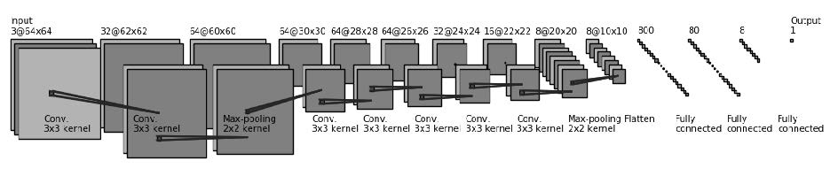

## ISONet

## ISONet: ISO Setting Estimation Based on Convolutional Neural Network and Its Application in Image Forensics 

### Abstract
The ISO setting, which is also known as film speed, determines the noise characteristics of the output images. As a consequence, it plays an important role in noise based forensics. However, the ISO setting information from the image metadata may be unavailable in practice. Hence, estimating the ISO setting of a probe image from its content is of forensic significance. In this work, we propose a convolutional neural network, which is called ISONet, for ISO setting estimation purpose. The proposed ISONet can successfully infer the ISO setting both globally (image-level) and locally (patch-level). It is not only work on uncompressed images, but also effective on JPEG compressed images. We apply the ISONet into two typical forensic scenarios, one is the image splicing localization and the other is the Photo Response Non-Uniformity (PRNU) correlation prediction. A series of experiments show that the ISONet can yield a remarkable improvement in both forensic scenarios.

submitted to IWDW2020

### Network structure

### Dependencies
From running our demo,following packages are required
- pytorch >=1.3
- opencv-python 
- matplotlib
- h5py
- numpy
- tensorboard

### Test ISONet

#### Test ISONet_Uncompressed

Run `python test_model.py --model_path models/net_tif.pth --pic_path image_path  `  
or   
Run Fig3.py to repeat the ISO metric map used for Fig.3

#### Test ISONet_JPEG
Run`python test_model.py --model_path models/net_jpg.pth --pic_path image_path `  
or  
Run Fig5.py to repeat the global ISO metric used for Fig.5

### Train ISONet
Take ISONet_Uncompressed for example

1. Download the training images to IMG_DATA_DIR of your computer

2. run`prepare_data.py` to generate the training set

   `python prepare_data.py --aug_times 3 --pic_type tif --data_path IMG_DATA_DIR --save_path DATA_PATH`

3. Run `main_train.py` to train the model
 `python main_train.py --data_path DATA_PATH`
